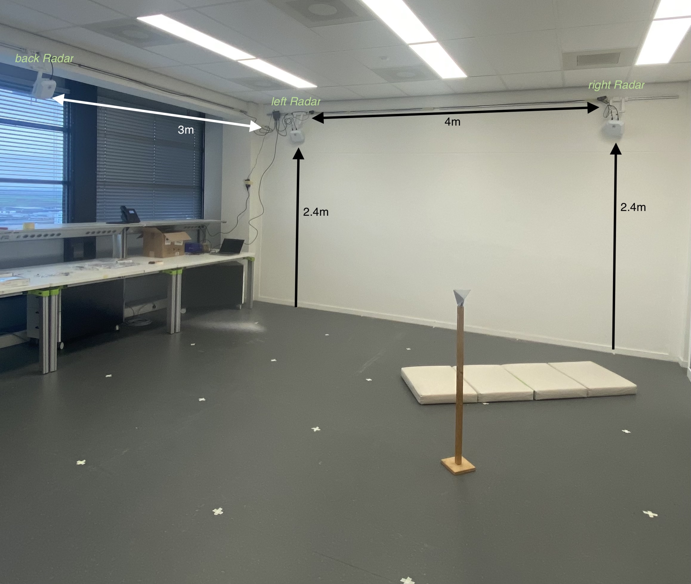
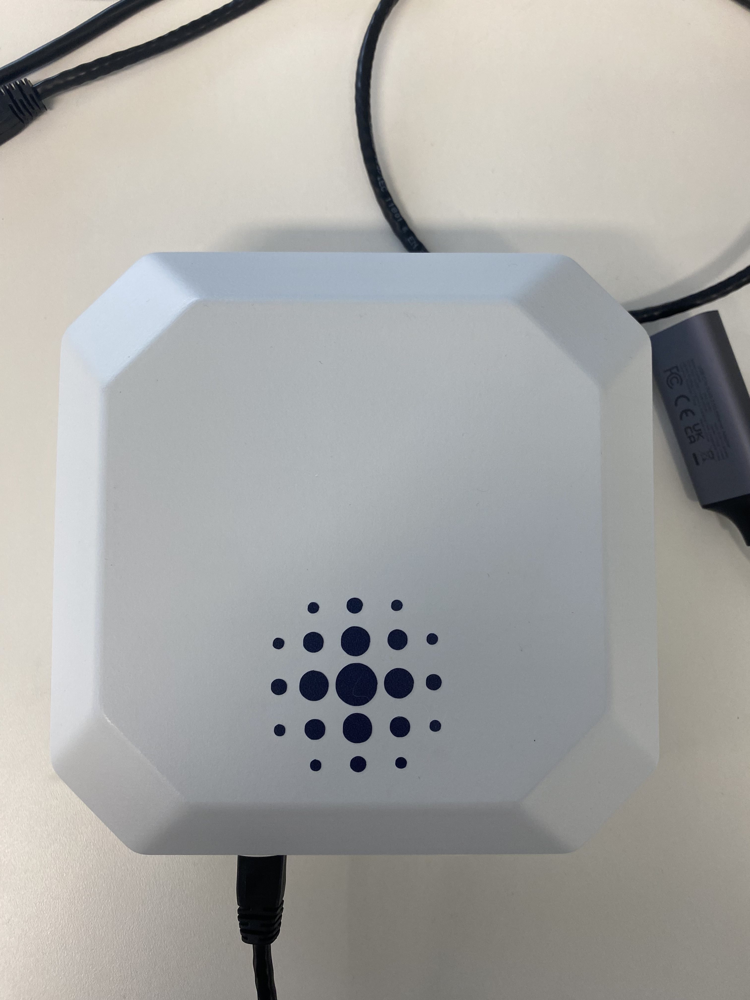

# Dataset of vital sign measurement with three FMCW radars at elevated position - Nov 2025

# README
Datset & code: [10.4121/169cadca-e5dd-46e7-a9c5-91a4c9b1ff28](https://doi.org/10.4121/169cadca-e5dd-46e7-a9c5-91a4c9b1ff28)
GitHub code for parsing the data with MATLAB or Python: [Dopplium/dopplium-parser](https://github.com/Dopplium/dopplium-parser)
GitHub code examples with MATLAB: [Dataset-Nov-2025](https://github.com/mwendelm/Dataset-Nov-2025)

Dataset: Dataset of vital sign measurement with three FMCW radars at elevated position - Nov 2025
Responsible Author: Mareike Wendelmuth
email: <m.wendelmuth@tudelft.nl>
Created: 15-01-2026
Modified: -

# Table of Contents
1. [Referencing the dataset](#reference)
2. [References and background reading material for the used dataset](#paper)
3. [MATLAB and Python load file](#load)
4. [Radar Setup](#setup)
	1. [Radar parameters](#radar_parameters)
5. [Participants](#participants)
6. [Activities](#activities)
7. [File names](#naming)
8. [Calibration](#calibration)
9. [Remarks](#remarks)
10. [References](#references)

## Referencing the dataset <a name="reference"></a>
Wendelmuth, M., Yarovoy, A., Fioranelli, F.. 'Dataset of vital sign measurements with three FMCW radars at elevated position - Nov 2025'. (4TU.ResearchData, 2026 [Online]. doi: https://doi.org/10.4121/169cadca-e5dd-46e7-a9c5-91a4c9b1ff28. Available from: [https://doi.org/10.4121/169cadca-e5dd-46e7-a9c5-91a4c9b1ff28](https://doi.org/10.4121/169cadca-e5dd-46e7-a9c5-91a4c9b1ff28)

```
@misc{Wendelmuth2026_dataset,
author={Wendelmuth, Mareike and Yarovoy, Alexander and Fioranelli, Francesco},
title={Dataset of vital sign measurement with three FMCW radars at elevated position - Nov 2025},
url={https://doi.org/10.4121/169cadca-e5dd-46e7-a9c5-91a4c9b1ff28},
DOI={10.4121/169cadca-e5dd-46e7-a9c5-91a4c9b1ff28},
publisher={4TU.ResearchData},
year={2025 [Online]},
month={Jan} }
```

## References and background reading material for the used dataset <a name="paper"></a>
<!-- The published papers will be put here -->

## MATLAB and Python load file <a name="load"></a>
The data can be loaded with the Dopplium parser from here: [Dopplium/dopplium-parser](https://github.com/Dopplium/dopplium-parser)

## Radar setup <a name="setup"></a>
Three Dopplium radar units [1], each combining an IWR6843ISK radar board and DCA1000EVM evaluation board [2], were mounted at 2.4 m height and tilted toward the center of the room. Two units were placed on the front wall (referred to as ‘left’ and ‘right’) and one on the side wall (‘back’). The radars operated in frequency division multiple access mode at 60, 61.25, and 62.5 GHz with a bandwidth of 1 GHz. 

The experimental setup is shown in [Figure 1](figure1) and the ussed radar is shown in [Figure 2](figure2). The flooring included a 5 x 5 m grid for definition of participants location. The grid is defined with the 1,1 (y,x) location closest to the left Radar and an increasing x position towards the right radar and an increasing y position to the back Radar. A calibration dataset with the visible corner reflector at different positions was recorded and is explained in [Calibration](#calibration)


*Figure 1: Placement of the three radars in the room.*


*Figure 2: Dopplium radar*

Ground truth respiration data was recorded using a Vernier Go Direct belt [3]; the radar and belt signals were aligned manually.

Additionally, the participants were recorded with 1-3 cameras as ground truth for their location. Due to privacy, this data is not included in the public dataset. It is possible to ask the authors for information, which might be visible in the camera recording.
### Radar parameters <a name="radar_parameters"></a>
The radar parameters varied a bit between the radars and recording. They are saved in the file and can be extracted using the parser. The general parameter are given in the following:

| Parameter           | Value               |
| ------------------- | ------------------- |
| Start freq          | 60, 61.25, 62.5 GHz |
| ADC samples         | 80                  |
| Frequency slope     | 25 MHz/$\mu s$      |
| Bandwidth           | 1 GHz               |
| Chirps per frame    | 120                 |
| Frame periodicity   | 100 ms              |
| Active TX / RX      | 3 / 4               |
|                     |                     |
| Maximum range       | 11.99 m             |
| Range resolution    | 0.15 m              |
| Maximum velocity    | 3.1 m/s             |
| Velocity resolution | 0.15 m/s            |

## Participants <a name="participants"></a>
The dataset includes measurements of 18 participants.
13 male and 5 female.
The mean age was 32.1 years with a standard deviation (STD) of 8.9 years, and the average height was 176.1 cm with a STD of 8.2 cm. The data collection was approved by the TU Delft HREC Committee, and each participant signed a consent form.

## Activities <a name="activities"></a>
Each participant completed 6 activities, inspired by collab-
orators in the area of psychiatry and mental health:
### 1. Sitting
The participant had to sit on the folded mattress at position \[3,3] for  2 minutes. The facing direction was free of their choice. After 60 seconds of normal breathing a signal occurred and the participant was asked to breath faster for 20 seconds. After that normal breathing for 40 seconds was continued.

### 2. Sitting arbitrary location
The participant had to sit on the folded matthress at an arbitrary position within the 5x5 grid, facing in any direction. The participant was asked to sit still and breath normal for 60 seconds.

### 3.  Laying back 
The participant had to lay on the back (i.e., in a supine position) on the unfolded mattress at position \[3,3] for  2 minutes. The  direction (horizontal, vertical) was free of their choice. After 60 seconds of normal breathing a signal occurred and the participant was asked to breath faster for 20 seconds. After that normal breathing for 40 seconds was continued.

### 4.  Laying
The participant had to lay on the unfolded mattress at an arbitrary position (side, back, belly) within the 5x5 grid, facing in any direction. The participant was asked to sit still and breath normal for 60 seconds.

### 5. Restless 
The participant had to lay on the unfolded mattress at an arbitrary position (side, back, belly) within the 5x5 grid, facing in any direction. After 15 seconds a signal occured and the participant was asked to change their laying position (e.g., from back to side). During the complete 60 seconds of the recording the participant was asked to breath normally.

### 6. Continuous movements
A sequence of 5 minutes with free movements in between was recorded. The participant heard a signal every 30 seconds. Then, they had 10 seconds to change the position. This included standing up, moving in the room, sitting, etc. The only restriction was that the participant had to stay within the 5x5 grid and should then be as still as possible for the next 20 seconds of the recording. The sequence started with 30 seconds without movement.

## File names <a name="naming"></a>
All uploaded files were named in the following way:
```
Participant*id*:_activity*nr*_data_*node*.bin
```
## Calibration <a name="calibration"></a>
For calibration, a corner reflector was put at four different positions within the 5x5 grid. For each measurement it was pointed towards the regarding radar. The calibration files are named accordingly as:
```
Calibration_[*x-coordinate*,*y-coordinate*]_*node*.bin
```
The distance from the corner reflector to the individual radar nodes was measured with a laser measure device and the values are given below. Additionally, the empty room without the corner reflector was measured. 

| Position in the grid | Distance to left Radar \[m] | Distance to right Radar \[m] | Distance to back Radar \[m] |
| -------------------- | --------------------------- | ---------------------------- | --------------------------- |
| \[2,2]               | 2                           | 4.1                          | 3                           |
| \[2,4]               | 3.3                         | 4.3                          | 2.2                         |
| \[4,2]               | 3.5                         | 2                            | 4.5                         |
| \[4,4]               | 4.4                         | 3.2                          | 4                           |

## Remarks <a name="remarks"></a>
Some activities for some participants are recorded multiple times, as the first recording was not sufficient (e.g. one radar did not record). The naming is then increasing with and underscore.
Some data recording might have ended earlier or did start later due to malfunction of the radars. The authors do not promise completion of the dataset.

## References <a name="references"></a>
[1] Dopplium, www.dopplium.com. 
[2] Texas Instruments IWR6843ISK, https://www.ti.com/tool/IWR6843ISK.
[3] Vernier Go Direct Respiration Belt, https://www.vernier.com/.
